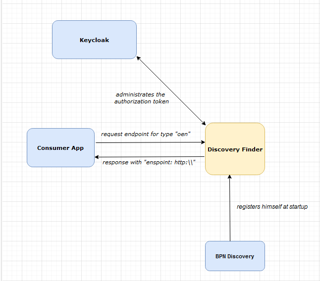

## 3 System scope and context

### Business Context

| Neighbor      | Description                                          |
|---------------|------------------------------------------------------|
| Consumer App  | Searches for endpoints for a given type, e.g.  "oen" |
| BPN Discovery | Registers himself at startup                         |
| Keycloak      | Administrates the authorization token                |

### Technical Context

| Neighbor      | Description                                                           |
|---------------|-----------------------------------------------------------------------|
| Consumer App  | Requests for a BPN Discovery for a certain type like "oen"            |
| Keycloak      | Generates token for users and provides id management of user and service |
| BPN Discovery | Registers himself at startup                                          |