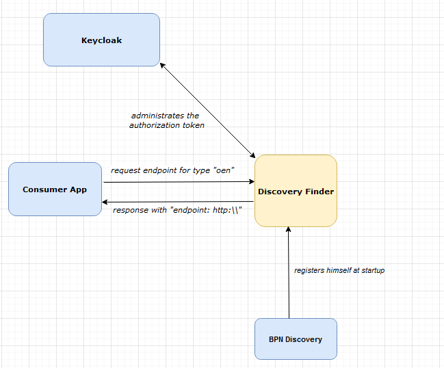
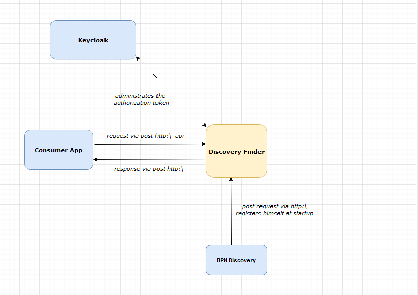

## 3 System scope and context

### Business Context

| Neighbor      | Description                                          |
|---------------|------------------------------------------------------|
| Consumer App  | Searches for endpoints for a given type, e.g.  "oen" |
| BPN Discovery | Registers himself at startup                         |
| Keycloak      | Is used for token validation                         |

### Technical Context

| Neighbor      | Description                                                              |
|---------------|--------------------------------------------------------------------------|
| Consumer App  | Requests for a BPN Discovery for a certain type like "oen"               |
| Keycloak      | Generates token for users and provides id management of user and service |
| BPN Discovery | Registers itself at startup                                              |

### NOTICE

This work is licensed under the [Apache-2.0](https://www.apache.org/licenses/LICENSE-2.0).

- SPDX-License-Identifier: Apache-2.0
- SPDX-FileCopyrightText: 2023 Robert Bosch Manufacturing Solutions GmbH
- SPDX-FileCopyrightText: 2023 Contributors to the Eclipse Foundation
- Source URL: https://github.com/eclipse-tractusx/sldt-discovery-finder.git