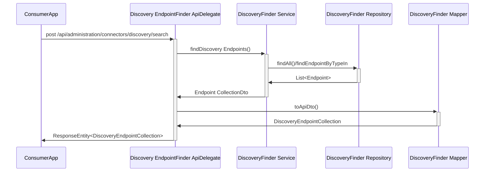
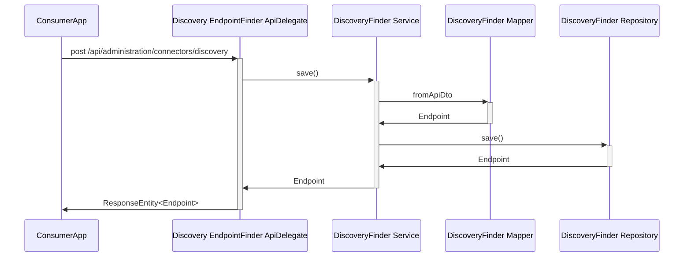
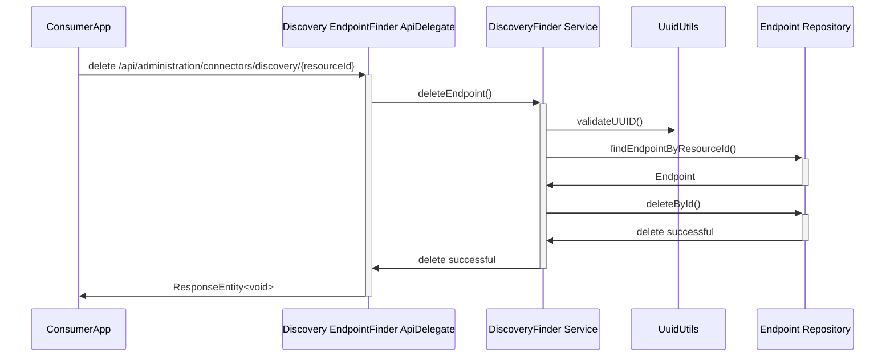

## 4 Runtime-view

### Search request

1.  The ConsumerApp sends a request of a certain type to
    DiscoveryEndpointFinderApiDelegate.

2.  DiscoveryEndpointFinderApiDelegate calls DiscoveryFinderService to
    find DiscoveryEndpoints.

3.  DiscoveryFinderService calls EndpointRepository to search in
    database.

4.  BPNDiscoveryService sends as a result an EndpointCollectionDto to
    DiscoveryEndpointFinderApiDelegate.

5.  DiscoveryEndpointFinderApiDelegate sends a response to the
    ConsumerApp with the found results.

### Add request

1.  The Data Provider sends a request with a given endpoint to
    DiscoveryEndpointFinderApiDelegate.

2.  DiscoveryEndpointFinderApiDelegate calls DiscoveryFinderService to
    save this entry. Within this call the DiscoveryFinderMapper maps the
    request object to an Enpoint.

3.  DiscoveryFinderService calls the EndpointRepository to save the new
    entry in the database.

### Delete request

1.  The Data Provider sends a request to delete an entry to
    DiscoveryEndpointFinderApiDelegate.

2.  DiscoveryEndpointFinderApiDelegate calls the DiscoveryFinderService
    to delete the Endpoint.

3.  DiscoveryFinderService calls UuidUtils to validate the resourceId.

4.  DiscoveryFinderService calls the EndpointRepository to find the
    entry or throws an exception if the entry can't be found.

5.  DiscoveryFinderService calls the EndpointRepository to delete
    finally the entry from the database.

### NOTICE

This work is licensed under the [Apache-2.0](https://www.apache.org/licenses/LICENSE-2.0).

- SPDX-License-Identifier: Apache-2.0
- SPDX-FileCopyrightText: 2023 Robert Bosch Manufacturing Solutions GmbH
- SPDX-FileCopyrightText: 2023 Contributors to the Eclipse Foundation
- Source URL: https://github.com/eclipse-tractusx/sldt-discovery-finder.git