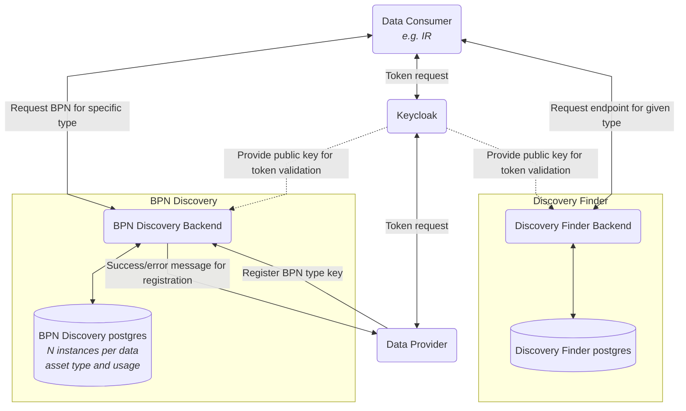

## 6 Crosscutting Concept

### Overall Concept

The overall concept can be found under **2 Architecture and
constraints**.

### Discovery Finder API

The Discovery Finder is a central component in the environment. Every
consumer and data provider can call this service via the given api
endpoints.

The api with its links can be found here: [Discovery Finder Api]( https://semantics.int.demo.catena-x.net/discoveryfinder/swagger-ui/index.html)

#### POST [/api/v1.0/administration/connectors/discovery]

Define the endpoint to BPN discovery services and the EDC discovery
service.

**Request body:**

```json
{
  "type": "oen",
  "description": "Service to discover BPN to a particular OEN",
  "endpointAddress": "http://...",
  "documentation": "http://.../swagger/index.html",
  "timeToLive": 31536000
}
```

**Response:**

```json
{
  "type": "oen",
  "description": "Service to discover BPN to a particular OEN",
  "endpointAddress": "http://...",
  "documentation": "http://.../swagger/index.html",
  "resourceId": "ec6f407b-4296-418c-9e4e-fb739fe72a67",
  "timeToLive": 31536000
}
```

This service is allowed to **administrators only**.


#### POST [/api/v1.0/administration/connectors/discovery/search]

Find the endpoints to BPN discovery services and the EDC discovery
service.

**Request body:**

```json
{
"types": 
 [
   "oen", 
   "bpid"
 ]
}
```

**Response:**

```json
{"endpoints":
 [
  {
    "type": "oen",
    "description": "Service to discover BPN to a particular OEN",
    "endpointAddress": "http://...",
    "documentation": "http://.../swagger/index.html",
    "resourceId": "ec6f407b-4296-418c-9e4e-fb739fe72a67",
    "timeToLive": 31536000
  },
  {
    "type": "bpid",
    "description": "Service to discover BPN to a particular Battery Pass ID",
    "endpointAddress": "http://...",
    "documentation": "http://.../swagger/index.html",
    "resourceId": "08702529-3714-4c4f-b022-346b9b4fbbe2",
    "timeToLive": 31536000
  }
 ]
}
```

#### DELETE [/api/v1.0/administration/connectors/discovery/{resourceId}]

Delete the endpoint to BPN discovery services and the EDC discovery service.
This service is allowed to **administrators only**.

Path variable {resourceId} is required
Response: http Status Code 204 -> no response

An OpenApi.yaml for this service can be found under:
"backend/src/main/resources/static/discovery-finder-openapi.yaml" [Link](https://github.com/eclipse-tractusx/sldt-discovery-finder/blob/main/backend/src/main/resources/static/discovery-finder-openapi.yaml)


### Security / Safety / Use of JWT Token

The whole environment is secured with OAuth2. We used and recommend the usage of Keycloak. The Discovery Finder has
a realm entry in Keycloak. Every user who wants to use Discovery Finder
need the corresponding roles for his user.

The roles are:

1. [ ] *VIEW*( "view_discovery_endpoint" )
2. [ ] *ADD*( "add_discovery_endpoint" )
3. [ ] *DELETE*( "delete_discovery_endpoint" )

These roles are sent within a JWT Token generated by Keycloak.

With all three roles it is possible to add and delete entries from the
Discovery Finder Database. For searching the view role is sufficient.
The credentials are set with entries in Helm Charts.

### Authentication & Authorization
The service is secured by a OAuth2 compliant authorization. Every API call has to provide a
valid Bearer Token. Authorization is provided by a role based access. These roles are possible:

| Role                      | Description                            |
|---------------------------|----------------------------------------|
| view_discovery_endpoint   | can search for BPN Discovery endpoints |
| add_discovery_endpoint    | can add BPN Discovery endpoints        |
| delete_discovery_endpoint | can delete BPN Discovery endpoints     |


### Security Assessment
#### Data Flow Diagram



### NOTICE
This work is licensed under the [Apache-2.0](https://www.apache.org/licenses/LICENSE-2.0).

- SPDX-License-Identifier: Apache-2.0
- SPDX-FileCopyrightText: 2023 Robert Bosch Manufacturing Solutions GmbH
- SPDX-FileCopyrightText: 2023 Contributors to the Eclipse Foundation
- Source URL: https://github.com/eclipse-tractusx/sldt-discovery-finder.git