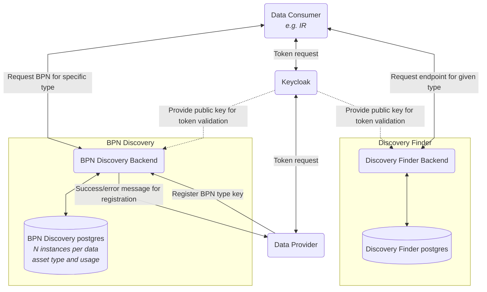

# Developer Documentation Tractus-X Discovery Finder

This page provides an overview of the Discovery Finder.

## Architectural Overview
The Digital Twins are no longer administrated in a central registry. The implementation of two services, "Discovery Finder" and "BPN
Discovery", ensures that EDCs still can be found in the decentralized environment.
The Discovery Finder hereby is responsible to send endpoints from BPN Discoveries for a specific type.

## Actors
There are two actors who interact with the Discovery Finder

| Actor         | Description                                                                                                  | Example                                               |
|---------------|--------------------------------------------------------------------------------------------------------------|-------------------------------------------------------|
| Data Consumer | The data consumer uses the Discovery Finder to search for endpoints for BPN Discoveries for a specific type. |                                                       |
| Data Provider | The data provider adds or deletes his endpoint at the Discovery Finder                                       | A BPN Discovery registers its endpoint after startup. |
| Keycloak      | Keycloak is used for token validation                                                                        |                                                       |

## Discovery Finder Api

The Discovery Finder provides a Swagger-Interface for all its endpoints:
https://semantics.int.demo.catena-x.net/discoveryfinder/swagger-ui/index.html

## Authentication & Authorization
The service is secured by a OAuth2 compliant authorization. Every API call has to provide a
valid Bearer Token. Authorization is provided by a role based access. These roles are possible:

| Role                      | Description                            |
|---------------------------|----------------------------------------|
| view_discovery_endpoint   | can search for BPN Discovery endpoints |
| add_discovery_endpoint    | can add BPN Discovery endpoints        |
| delete_discovery_endpoint | can delete BPN Discovery endpoints     |

## Deployment

To deploy this system, you need to use the Helm Chart in a running
Kubernetes cluster. The Helm Chart is located under
"charts/discoveryfinder". For further information
checkout the [README.md](https://github.com/eclipse-tractusx/sldt-discovery-finder/blob/main/README.md) and the [INSTALL.md](INSTALL.md). 

## Security Assessment

### Data Flow Diagram

### NOTICE

This work is licensed under the [Apache-2.0](https://www.apache.org/licenses/LICENSE-2.0).

- SPDX-License-Identifier: Apache-2.0
- SPDX-FileCopyrightText: 2023 Robert Bosch Manufacturing Solutions GmbH
- SPDX-FileCopyrightText: 2023 Contributors to the Eclipse Foundation
- Source URL: https://github.com/eclipse-tractusx/sldt-discovery-finder.git
